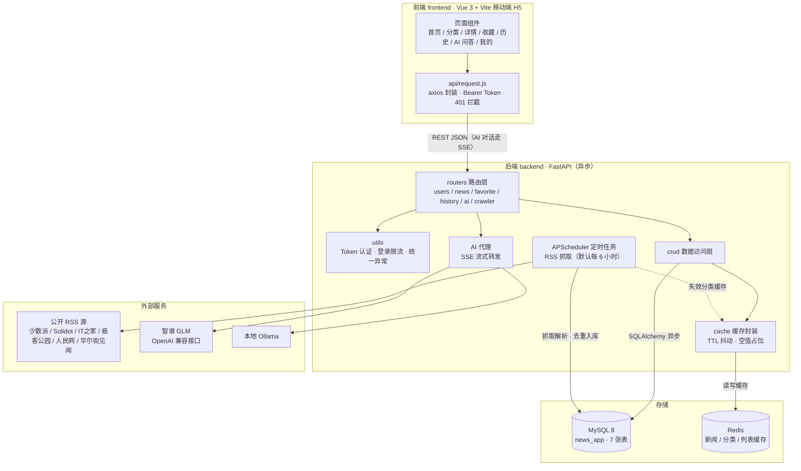
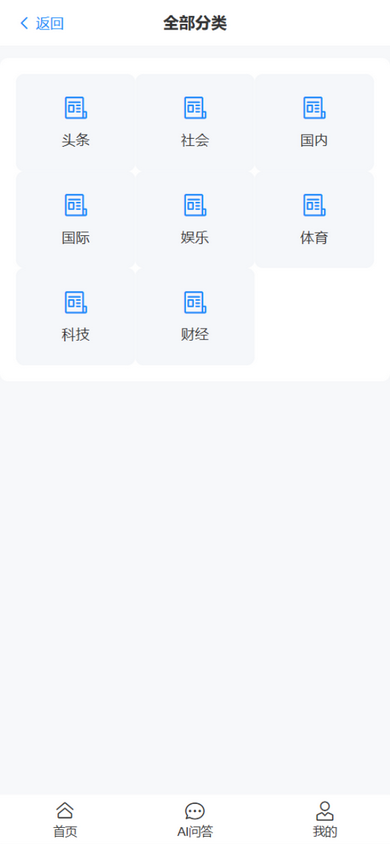
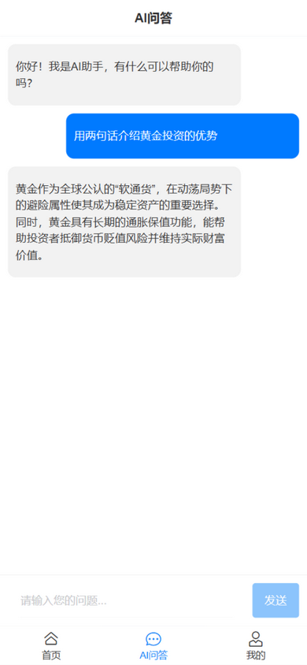
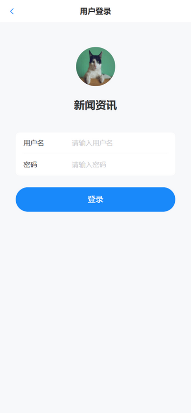
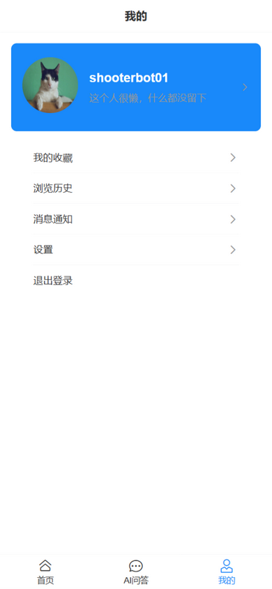

# AI头条新闻系统 (Toutiao News)

一个基于 FastAPI 和 SQLAlchemy 构建的现代化新闻系统，支持用户注册登录、新闻浏览、收藏、历史记录与 AI 问答等功能，新闻内容由内置 RSS 定时爬虫自动采集。

## 1-1 项目概述

这是一个仿今日头条的新闻系统，采用前后端分离结构：后端使用异步 Python 框架 FastAPI 开发，使用 MySQL 作为数据库存储，通过 SQLAlchemy ORM 进行数据访问，Redis 作为缓存层；前端为 Vue 3 移动端 H5 应用。系统提供完整的用户管理、新闻浏览、收藏和历史记录功能。

### 系统架构



整体链路：前端 axios 携带 Token 调用 REST 接口；新闻数据由种子数据与 RSS 定时爬虫共同提供（启动即抓一次，之后默认每 6 小时，`CRAWL_INTERVAL_HOURS` 可调，入库后自动失效对应分类缓存）；AI 对话由后端代理转发到智谱或本地 Ollama，密钥只存后端 `.env`。

### 界面预览

<table>
  <tr>
    <td align="center"><br/><sub>首页</sub></td>
    <td align="center"><br/><sub>分类</sub></td>
    <td align="center"><br/><sub>新闻详情</sub></td>
    <td align="center"><br/><sub>AI 问答</sub></td>
  </tr>
  <tr>
    <td align="center"><br/><sub>收藏</sub></td>
    <td align="center"><br/><sub>浏览历史</sub></td>
    <td align="center"><br/><sub>登录 / 注册</sub></td>
    <td align="center"><br/><sub>个人中心</sub></td>
  </tr>
</table>

## 1-2 技术栈

**后端**
- **后端框架**: FastAPI
- **数据库**: MySQL
- **ORM**: SQLAlchemy (异步)
- **数据库驱动**: aiomysql
- **密码加密**: bcrypt（直接使用，不经过停更的 passlib）
- **缓存系统**: Redis
- **AI 代理**: httpx（异步转发智谱/本地 Ollama 的 OpenAI 兼容接口）
- **定时爬虫**: APScheduler + feedparser + selectolax（RSS 定时抓取与解析）
- **环境管理**: conda（项目内独立环境，见 `backend/environment.yml`）

**前端**
- **框架**: Vue 3（组合式 API）
- **构建工具**: Vite
- **状态管理**: Pinia
- **UI 组件库**: Vant 4
- **国际化**: vue-i18n

## 1-3 项目结构

```
FoundGoldenNews/                        # 仓库根目录
├── backend/                            # 后端（FastAPI）
│   ├── crud/                           # 数据访问层（CRUD操作）
│   │   ├── ai.py                       # AI聊天记录相关数据库操作
│   │   ├── favorite.py                 # 收藏相关数据库操作
│   │   ├── history.py                  # 历史记录相关数据库操作
│   │   ├── news.py                     # 新闻相关数据库操作（含缓存读写与失效）
│   │   └── users.py                    # 用户相关数据库操作
│   ├── models/                         # 数据模型定义（SQLAlchemy）
│   ├── routers/                        # API路由定义
│   ├── schemas/                        # 数据验证模型（Pydantic）
│   ├── cache/                          # 缓存键与序列化封装
│   ├── crawler/                        # RSS 爬虫（异步定时抓取公开源）
│   │   ├── rss_service.py              # 抓取→解析→按(标题,分类)去重入库→失效分类缓存
│   │   └── sources.py                  # RSS 源列表与抓取间隔配置
│   ├── utils/                          # 工具函数（认证/限流/异常）
│   ├── config/                         # 配置相关
│   │   ├── ai_conf.py                  # AI提供方配置（读环境变量）
│   │   ├── db_conf.py                  # 数据库配置（读环境变量）
│   │   └── cache_conf.py               # Redis缓存配置（读环境变量）
│   ├── main.py                         # 应用入口文件（含 RSS 定时抓取调度）
│   ├── requirements.txt                # Python 依赖清单（锁定版本）
│   ├── requirements-dev.txt            # 测试专用依赖（pytest/fakeredis/aiosqlite）
│   ├── tests/                          # pytest 测试套件（接口/缓存层/爬虫）
│   ├── environment.yml                 # conda 环境定义
│   ├── .env.example                    # 环境变量模板（复制为 .env 使用）
│   └── .env                            # 本机环境变量（不入库）
│
├── frontend/                           # 前端（Vue 3 + Vite）
│   └── src/
│       ├── views/                      # 页面组件
│       ├── components/                 # 公共组件
│       ├── store/                      # Pinia 状态管理
│       ├── api/request.js              # axios 统一封装（baseURL/Bearer Token/401 拦截）
│       ├── router/                     # 路由
│       ├── i18n/                       # 国际化（zh-CN / en-US）
│       └── config/api.js               # API 地址配置
│
├── docs/
│   ├── api-spec.md                     # API 接口规范文档（20 个接口）
│   ├── backend-learning.md             # 后端零基础学习与复现指南
│   ├── frontend-learning.md            # 前端学习文档（新成员上手指南）
│   └── screenshots/                    # 界面截图（README 展示用）
│
├── database/
│   └── database.sql                    # 建库建表 SQL（含 7 张表）
│
├── .gitignore
└── README.md
```

## 1-4 快速开始

> 只会 Python 基础、想从头理解并独立复现后端？直接看 [docs/backend-learning.md](docs/backend-learning.md)，按章节顺序边学边写。前端同理：新加入的前端开发者从 [docs/frontend-learning.md](docs/frontend-learning.md) 开始，覆盖目录结构、store 分工、路由与业务模块实现。

### 环境准备

1. MySQL 8.x 与 Redis 已在本地安装并启动
2. conda（Anaconda/Miniconda）已安装

### 后端启动

```bash
# 1. 创建项目内独立 conda 环境（不依赖本机 Anaconda base 的包）
cd backend
conda env create -f environment.yml -p .conda-env

# 2. 配置环境变量：复制模板并按需修改
cp .env.example .env

# 3. 初始化数据库（创建 news_app 库与 7 张表）
mysql -uroot -p --default-character-set=utf8mb4 < ../database/database.sql
# PowerShell 用户不支持 "<" 重定向，改用以下任一方式：
#   cmd /c "mysql -uroot -p --default-character-set=utf8mb4 < ..\database\database.sql"
#   或进入 mysql 客户端后执行: source D:/你的路径/FoundGoldenNews/database/database.sql
# 注意：种子数据全部使用 INSERT IGNORE，且 news 表有 (title, category_id) 唯一索引兜底，重复导入会自动去重跳过

# 4. 启动服务
conda activate ./.conda-env
uvicorn main:app --reload
```

启动后访问 http://127.0.0.1:8000/docs 查看接口文档。

> 应用启动时会先执行一次 RSS 抓取，之后默认每 6 小时自动抓取公开源（源列表与间隔见 `backend/crawler/sources.py`）。开发环境反复热重载时可设 `CRAWLER_ENABLED=false` 关闭定时抓取；也可登录后调用 `POST /api/crawler/run` 手动触发一次。

> 说明：也可以用 `conda run -p .conda-env uvicorn main:app --reload` 免激活直接运行；`--reload` 仅用于开发。

### 前端启动

```bash
cd frontend
npm install
npm run dev
```

启动后按提示打开本地地址（默认 http://localhost:5173）。

### 运行测试

```bash
# 后端：pytest 48 例（用户/新闻/收藏/历史接口 + 缓存层 + 爬虫 + 登录限流）
# 基于 aiosqlite + fakeredis 模拟，无需真实 MySQL/Redis
cd backend
conda run -p .conda-env python -m pytest
ruff check .   # lint；ruff 不随 requirements 安装，需先 pip install ruff

# 前端：vitest 18 例 + ESLint
cd frontend
npm run test
npm run lint
```

### 环境变量说明（backend/.env）

| 变量 | 说明 | 默认 |
| --- | --- | --- |
| `DB_USER` / `DB_PASSWORD` / `DB_HOST` / `DB_PORT` / `DB_NAME` | MySQL 连接信息 | root / 空 / localhost / 3306 / news_app |
| `SQL_ECHO` | 是否在控制台输出 SQL 日志 | false |
| `DEBUG_MODE` | true 时异常详情（含堆栈）返回给客户端，仅限本地开发 | false |
| `LOG_LEVEL` | 日志级别（DEBUG/INFO/WARNING/ERROR） | INFO |
| `REDIS_HOST` / `REDIS_PORT` / `REDIS_DB` / `REDIS_PASSWORD` | Redis 连接信息 | localhost / 6379 / 0 / 空 |
| `CORS_ORIGINS` | 生产环境前端来源白名单（逗号分隔） | 空 |
| `CRAWLER_ENABLED` | 是否启动 RSS 定时抓取（启动即抓一次，之后按 `CRAWL_INTERVAL_HOURS` 轮询；开发热重载可设 false） | true |
| `AI_PROVIDER` | AI 提供方：`zhipu`（智谱云端）/ `ollama`（本地） | zhipu |
| `AI_API_KEY` | 智谱 API Key（不入库；provider=ollama 时无需） | 空 |
| `AI_BASE_URL` | 智谱 OpenAI 兼容端点（走自建中转/代理时覆盖；provider=ollama 时无效） | https://open.bigmodel.cn/api/paas/v4/chat/completions |
| `AI_MODEL` | AI 模型名 | glm-4.7-flash |
| `OLLAMA_BASE_URL` | 本地 Ollama 服务地址 | http://localhost:11434 |
| `CRAWL_INTERVAL_HOURS` | RSS 定时抓取间隔（小时） | 6 |

### 前端环境变量（frontend/.env.local，模板见 frontend/.env.example）

| 变量 | 说明 | 默认 |
| --- | --- | --- |
| `VITE_API_BASE_URL` | 后端 API 基础地址 | http://127.0.0.1:8000 |

> AI 问答的提供方与密钥统一在 backend/.env 配置，前端不持有任何 Key。

## 1-5 功能模块

### 1. 用户管理模块

- 用户注册
- 用户登录
- 用户信息获取
- 用户信息更新
- 用户密码修改

### 2. 新闻模块

- 新闻分类获取
- 新闻列表获取（支持分页和分类筛选）
- 新闻详情获取
- 浏览量统计（详情响应返回后由后台任务异步 +1，接口返回自增前的值）

### 3. 收藏模块

- 添加收藏
- 取消收藏
- 收藏列表获取
- 清空所有收藏
- 检查收藏状态

### 4. 浏览历史模块

- 添加浏览记录
- 浏览历史列表获取
- 删除单条浏览记录
- 清空浏览历史

### 5. AI 问答模块

- AI 对话（SSE 流式，后端代理智谱/本地 Ollama，密钥由后端 .env 管理）
- 聊天历史记录（落库 ai_chat 表）

### 6. 缓存模块

- 新闻详情缓存
- 新闻列表缓存
- 分类数据缓存
- 用户历史记录缓存

### 7. 数据采集模块（RSS 爬虫）

- 定时抓取公开 RSS 源（启动即抓一次，默认每 6 小时，`CRAWLER_ENABLED=false` 可关闭）
- 按（标题，分类）去重入库，单源失败只记日志跳过，不影响其他源
- 入库后自动失效对应分类的列表/总数缓存
- 手动触发接口 `POST /api/crawler/run`（需登录）

## 1-6 数据库设计

建库建表 SQL 见 `database/database.sql`，库名 `news_app`（utf8mb4）。

### 主要数据表

1. **用户表 (user)** —— 用户基本信息，包含用户名、密码(加密)、昵称、头像等字段
2. **用户令牌表 (user_token)** —— 用户认证令牌管理，支持令牌过期机制；仅存令牌的 SHA-256 摘要，原始令牌只在注册/登录响应中返回一次
3. **新闻分类表 (news_category)** —— 新闻分类信息
4. **新闻表 (news)** —— 新闻内容存储，包含标题、内容、作者、浏览量等字段
5. **收藏表 (favorite)** —— 用户收藏记录，关联用户和新闻
6. **浏览历史表 (history)** —— 用户浏览历史记录，关联用户和新闻
7. **AI对话表 (ai_chat)** —— 用户 AI 问答记录

## 1-7 缓存设计

系统采用 Redis 作为缓存层，对高频访问的数据进行缓存，以提升系统性能和响应速度。

### 缓存数据类型

1. **新闻详情缓存**
    - 缓存键: `news:detail:{news_id}`
    - 过期时间: 5分钟（`backend/cache/news_cache.py`）

2. **新闻列表缓存**
    - 缓存键: `news:list:{category_id}:{page}:{size}`
    - 过期时间: 30分钟

3. **分类数据缓存**
    - 缓存键: `news:categories:{skip}:{limit}`（分页参数编入键，不同分页互不串页）
    - 过期时间: 2小时

4. **分类新闻总数缓存**
    - 缓存键: `news:count:{category_id}`
    - 过期时间: 30分钟
    - 列表接口分页总数不再每次执行 `count(*)`

5. **相关新闻缓存**
    - 缓存键: `news:related:{news_id}:{category_id}`
    - 过期时间: 30分钟

### 缓存更新机制

- 新闻浏览量写库成功后，自动失效该新闻的详情与相关新闻缓存（写后失效策略）
- 采用缓存失效而非主动更新策略
- 空结果（不存在的新闻/分类/相关新闻无结果）写入 60 秒短 TTL 占位，防止缓存穿透
- 各类缓存 TTL 附加 ±10% 随机抖动，避免同类键集中过期引发缓存雪崩
- Redis 不可用时自动降级为直连数据库

### 缓存配置

Redis 连接信息通过 `backend/.env` 环境变量配置（模板见 `.env.example`），由 `backend/config/cache_conf.py` 读取。

## 1-8 API 接口说明

完整的接口规范（含请求/响应示例）见 `docs/api-spec.md`，以下为接口清单。

### 用户相关接口

| 接口                 | 方法 | 说明         |
| -------------------- | ---- | ------------ |
| `/api/user/register` | POST | 用户注册     |
| `/api/user/login`    | POST | 用户登录     |
| `/api/user/info`     | GET  | 获取用户信息 |
| `/api/user/update`   | PUT  | 更新用户信息 |
| `/api/user/password` | PUT  | 修改用户密码 |

### 新闻相关接口

| 接口                   | 方法 | 说明             |
| ---------------------- | ---- | ---------------- |
| `/api/news/categories` | GET  | 获取新闻分类列表 |
| `/api/news/list`       | GET  | 获取新闻列表     |
| `/api/news/detail`     | GET  | 获取新闻详情     |

### 收藏相关接口

| 接口                   | 方法   | 说明             |
| ---------------------- | ------ | ---------------- |
| `/api/favorite/check`  | GET    | 检查新闻收藏状态 |
| `/api/favorite/add`    | POST   | 添加收藏         |
| `/api/favorite/remove` | DELETE | 取消收藏         |
| `/api/favorite/list`   | GET    | 获取收藏列表     |
| `/api/favorite/clear`  | DELETE | 清空所有收藏     |

### 浏览历史相关接口

| 接口                               | 方法   | 说明             |
| ---------------------------------- | ------ | ---------------- |
| `/api/history/add`                 | POST   | 添加浏览记录     |
| `/api/history/list`                | GET    | 获取浏览历史列表 |
| `/api/history/delete/{history_id}` | DELETE | 删除单条浏览记录 |
| `/api/history/clear`               | DELETE | 清空浏览历史     |

### AI 问答相关接口

| 接口                | 方法 | 说明                                        |
| ------------------- | ---- | ------------------------------------------- |
| `/api/ai/chat`      | POST | AI 对话（SSE 流式，走后端代理）             |
| `/api/ai/history`   | GET  | 获取聊天历史（落库 `ai_chat` 表）           |

### 数据采集相关接口

| 接口               | 方法 | 说明                              |
| ------------------ | ---- | --------------------------------- |
| `/api/crawler/run` | POST | 手动触发一次 RSS 抓取（需登录）   |

## 1-9 认证机制

系统使用基于令牌(Token)的认证机制：

1. 用户注册/登录成功后返回访问令牌
2. 需要认证的接口在请求头中添加 `Authorization: Bearer <token值>`（后端兼容直接传 token 值）
3. 令牌有效期为 7 天，每个用户仅保留一条有效令牌（重新登录覆盖旧令牌并重置有效期）
4. 服务端仅存令牌的 SHA-256 摘要，原始令牌只在注册/登录响应中返回一次，数据库泄露也不会暴露可用的会话凭证

## 1-10 错误处理

系统提供统一的错误处理机制（`backend/utils/exception.py`）：

- 用户认证失败返回 401 状态码（含登录用户名/密码错误）
- 资源不存在返回 404 状态码
- 请求参数校验失败返回 400 状态码（`data` 为字段级错误明细，如 `该字段为必填项` / `长度不足`）
- 数据库约束冲突返回 400 状态码（按具体约束返回对应提示）
- 登录尝试过于频繁返回 429 状态码（同一用户名 60 秒内最多 5 次，`utils/rate_limit.py`）
- 服务器内部错误返回 500 状态码
- 堆栈等调试信息仅在 `DEBUG_MODE=true` 时返回

## 1-11 开发规范

- 使用异步数据库操作
- 所有密码均加密存储（bcrypt）
- 接口返回统一的 JSON 格式
- 数据库与 Redis 连接信息一律走 `.env` 环境变量，禁止硬编码入库
- 缓存操作封装成独立函数便于调用

## 1-12 性能优化

- 使用 Redis 缓存热点数据
- 异步数据库操作提升并发性能
- 合理的数据库索引设计
- 连接池管理减少连接开销
- 空结果短 TTL 占位防缓存穿透，TTL 随机抖动防缓存雪崩

## 1-13 部署安全提醒

> 本项目以学习实践为目的，如需部署到公网，请至少完成以下检查：

- **关闭调试**：生产环境 `DEBUG_MODE` 必须为 `false`（否则异常堆栈等调试信息会直接返回给客户端），并配置 `CORS_ORIGINS` 来源白名单——开发模式默认放开所有源，仅限本地使用。
- **敏感信息不入库**：`backend/.env` 与 `frontend/.env.local` 已被 gitignore；`AI_API_KEY` 一旦泄漏立即到平台吊销重发（出现在 git 历史中的密钥一律视为已泄漏）。
- **数据库与 Redis 不裸奔**：设置强密码、仅监听本机/内网，不要将 3306/6379 端口直接暴露公网；MySQL 账号按最小权限授权。
- **爬虫合规**：内置源均为公开可订阅的 RSS，UA 中带项目标识；自行增删源时请遵守目标站点条款与 robots 协议，勿调高抓取频率。
- **内置防护**：密码 bcrypt 哈希存储、登录限流（同一用户名 60 秒内最多 5 次）、令牌 7 天过期；公网部署建议再叠加 HTTPS 与网关层限流。
